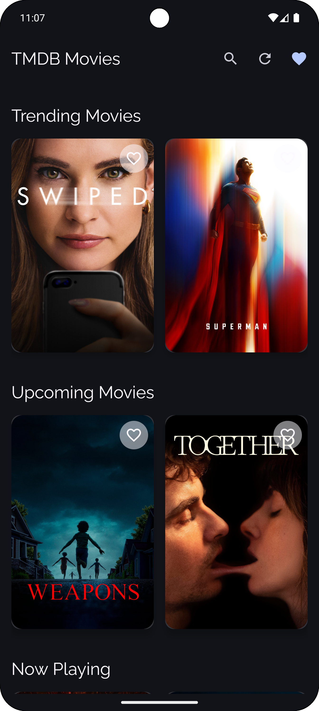
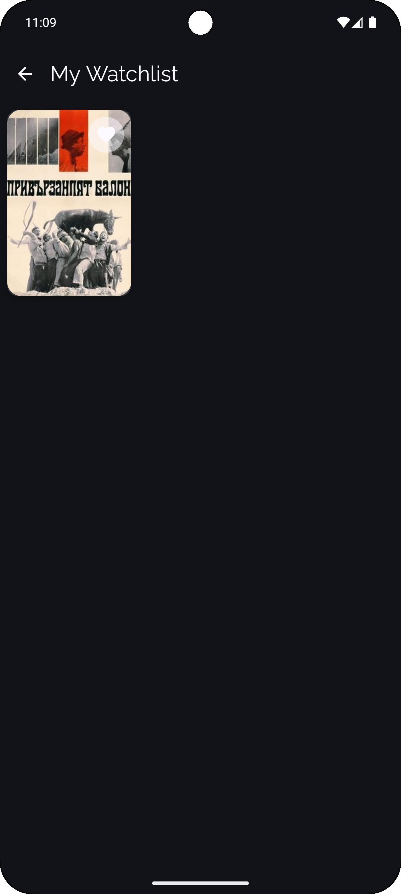
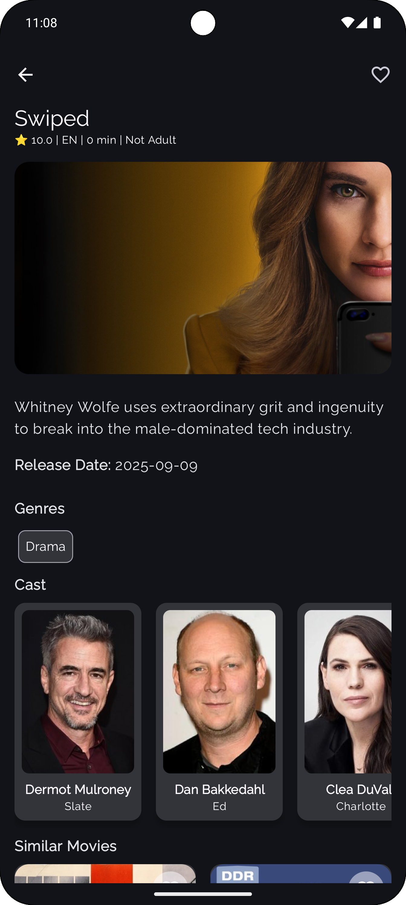

# 🎬 Android TMDB App

A modern Android application built with Jetpack Compose, Kotlin, Hilt, and The Movie Database (TMDB) APIs. This project follows best practices with modular architecture, dependency injection, and Jetpack libraries.

# Screenshots

<p float="left">
  
  
  
</p>

<p float="left">
  
  
</p>

---

## 🚀 Features

- Jetpack Compose UI with Material 3
- Modern Android development (Kotlin, Coroutines, ViewModel, Navigation)
- Hilt for Dependency Injection
- Room for local persistence
- Retrofit & OkHttp for networking
- Coil for image loading
- Paging 3 support
- Glance widgets
- Detekt static code analysis
- GitHub Actions CI-ready

---

## 🛠️ Project Setup

### 1. Clone the Repository

https://github.com/vennamprasad/Android-CICD.git

### 2. Setup local.properties
This file stores sensitive values like your TMDB API keys. It is excluded from Git tracking for security reasons.
```
📍 Location
Place it in the project root:
├── app/
├── build.gradle.kts
├── local.properties  ← Create this

KEY=your_tmdb_api_key
TOKEN=your_tmdb_bearer_token
```
